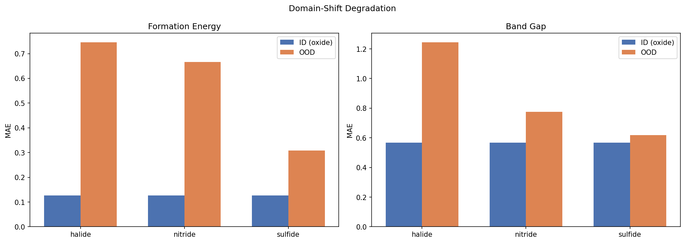
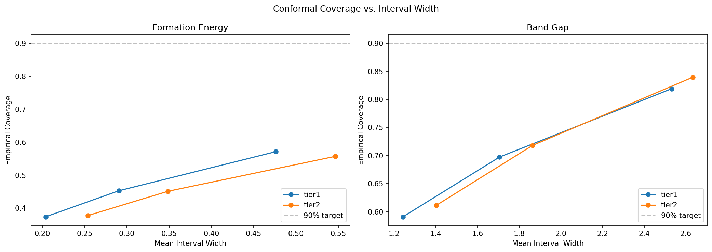
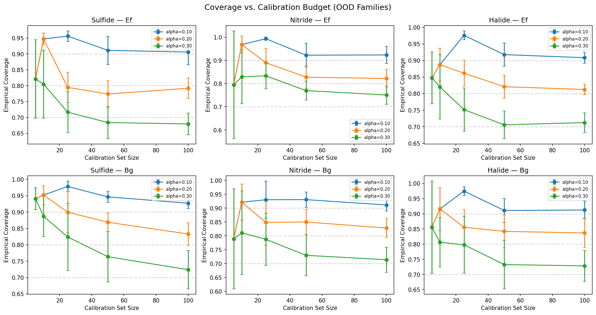
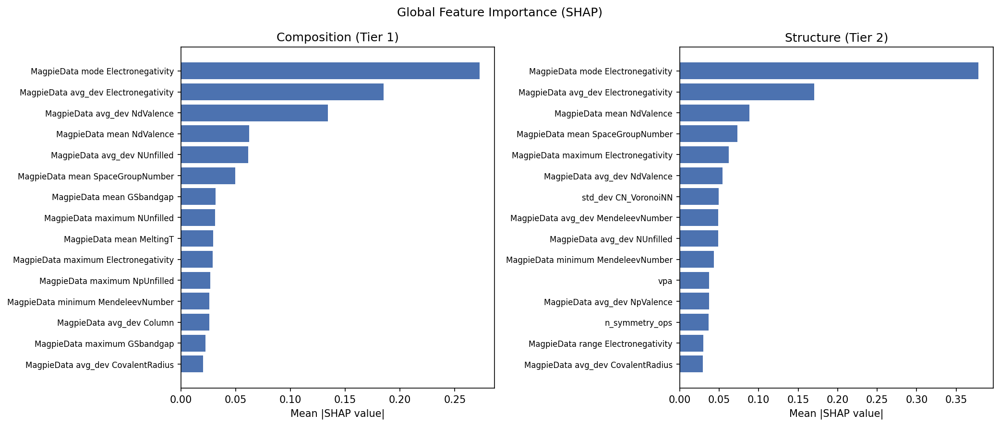

# crystal-prop-bench

Materials property prediction with calibrated uncertainty and chemical domain-shift evaluation.

## Motivation

AI-driven materials discovery depends on property predictors that are accurate,
well-calibrated, and honest about their limitations. Most materials ML benchmarks
report accuracy on random test splits — they don't ask what happens when the model
encounters a chemistry it wasn't trained on.

This benchmark evaluates tabular models (composition-only and structure-aware) on
Materials Project crystals, with a focus on:

1. **Domain-shift degradation** — how much does prediction quality degrade when
   moving from oxides (training domain) to sulfides, nitrides, and halides?
2. **Calibrated uncertainty** — do conformal prediction intervals maintain their
   coverage guarantees under chemistry shift?
3. **Calibration efficiency** — how many samples from a new chemistry family
   does a scientist need before uncertainty estimates become reliable?

## Key Findings

1. **Composition baseline strength.** Magpie + LightGBM achieves MAE = 0.122 eV/atom
   on formation energy (standard split) — confirming that composition alone explains
   most of the variance in DFT formation energies. Band gap is harder: MAE = 0.52 eV.

2. **Structure helps on standard splits, hurts under domain shift.** On the standard
   split, Tier 2 (Voronoi) improves formation energy MAE from 0.122 to 0.104 and
   band gap from 0.520 to 0.443. But under domain shift, Tier 2 *degrades*: band gap
   MAE rises to 0.598 (vs. Tier 1's 0.535), suggesting structural features overfit
   to oxide geometry and transfer poorly to other chemistries.

3. **Domain-shift degradation pattern.** Formation energy degrades severely under
   chemistry shift: MAE ratios of 2.5× (sulfide), 4.8× (nitride), and 6.6× (halide)
   relative to in-distribution oxide performance. Band gap degrades more moderately
   (1.2–2.4×), suggesting composition features transfer better for electronic properties.

4. **Conditional coverage breaks under shift.** Conformal prediction maintains ~90%
   marginal coverage on in-distribution oxides but collapses on OOD families.
   Formation energy coverage drops to 51% (sulfide), 26% (nitride), 28% (halide).
   Band gap coverage degrades less sharply: 88% (sulfide), 82% (nitride), 59% (halide).
   This is the central UQ finding — marginal guarantees do not imply conditional safety.

5. **Mixed training as domain randomization.** Training on all chemistry families
   recovers 70–86% of the formation energy degradation and 46–58% for band gap.
   Halides benefit most (86% recovery on formation energy), consistent with
   domain-randomization effects seen in sim-to-data.
6. **Calibration efficiency curve:** [result]

## Benchmark Results

| Tier | Split | Target | MAE | R² |
|------|-------|--------|-----|-----|
| Tier 1 (Magpie) | Standard | Formation Energy | 0.122 ± 0.002 eV/atom | 0.883 ± 0.003 |
| Tier 1 (Magpie) | Standard | Band Gap | 0.520 ± 0.005 eV | 0.770 ± 0.006 |
| Tier 1 (Magpie) | Domain-Shift (ID) | Formation Energy | 0.120 ± 0.002 eV/atom | 0.801 ± 0.013 |
| Tier 1 (Magpie) | Domain-Shift (ID) | Band Gap | 0.535 ± 0.005 eV | 0.740 ± 0.007 |
| Tier 2 (Voronoi) | Standard | Formation Energy | 0.104 ± 0.002 eV/atom | 0.953 ± 0.002 |
| Tier 2 (Voronoi) | Standard | Band Gap | 0.443 ± 0.001 eV | 0.830 ± 0.000 |
| Tier 2 (Voronoi) | Domain-Shift (ID) | Formation Energy | 0.134 ± 0.017 eV/atom | 0.837 ± 0.103 |
| Tier 2 (Voronoi) | Domain-Shift (ID) | Band Gap | 0.598 ± 0.011 eV | 0.708 ± 0.027 |

## Domain-Shift Analysis

Models trained on oxides degrade substantially on other chemistry families.
Formation energy is most affected — halides show 6.6× MAE degradation:

| Target | OOD Family | ID MAE | OOD MAE | Degradation |
|--------|-----------|--------|---------|-------------|
| Formation Energy | Sulfide | 0.120 | 0.303 | 2.5× |
| Formation Energy | Nitride | 0.120 | 0.572 | 4.8× |
| Formation Energy | Halide | 0.120 | 0.794 | 6.6× |
| Band Gap | Sulfide | 0.535 | 0.619 | 1.2× |
| Band Gap | Nitride | 0.535 | 0.729 | 1.4× |
| Band Gap | Halide | 0.535 | 1.306 | 2.4× |



## Uncertainty Quantification

Split conformal regression maintains ~90% coverage on in-distribution oxides
but collapses under chemistry shift. At alpha=0.10 (target 90% coverage):

| Target | Test Set | Coverage |
|--------|----------|----------|
| Formation Energy | ID (oxide) | 90.8% |
| Formation Energy | OOD sulfide | 51.3% |
| Formation Energy | OOD nitride | 25.7% |
| Formation Energy | OOD halide | 27.9% |
| Band Gap | ID (oxide) | 90.2% |
| Band Gap | OOD sulfide | 88.2% |
| Band Gap | OOD nitride | 82.2% |
| Band Gap | OOD halide | 59.0% |

Marginal conformal guarantees do not imply conditional safety under domain shift.





## Explainability

SHAP analysis reveals that electronegativity features dominate both tiers:
`MagpieData mode Electronegativity` is the top feature for Tier 1 and Tier 2.
In Tier 2, Voronoi coordination number standard deviation (`std_dev CN_VoronoiNN`)
ranks 7th, confirming that structural features contribute but don't dominate.

Failure cases differ completely between tiers: **0% overlap** in the 50
worst-predicted crystals. Tier 1 failures concentrate in oxides (43/50),
while Tier 2 failures distribute more evenly across families (24 oxide,
12 halide, 8 sulfide, 6 nitride). The tiers fail on different crystals
for different reasons.



## Connection to Conditional Crystal Generation

Property predictors play four roles inside a conditional crystal generation pipeline:

- **Conditioning oracle.** A generator (e.g., CDVAE, DiffCSP) conditions on target
  properties like band gap = 1.5 eV. The property predictor validates whether
  generated candidates actually hit those targets, closing the loop between
  generation and evaluation.

- **Validity filter.** Physically unreasonable predictions (e.g., negative band gap,
  formation energy far outside the training distribution) serve as a structural
  validity proxy — flagging generated structures that are likely unphysical before
  expensive DFT validation.

- **Ranking function.** In a discovery campaign generating thousands of candidates,
  the predictor ranks them by predicted proximity to target properties. This
  prioritization determines which candidates proceed to synthesis or simulation.

- **Selective prediction for triage.** Conformal prediction intervals identify which
  candidates the predictor is confident about (narrow intervals → route to synthesis)
  versus uncertain about (wide intervals → route to DFT validation first). The
  calibration efficiency curve from this benchmark directly informs how many DFT
  calculations are needed to trust the predictor on a new chemistry.

## Relationship to Other Benchmarks

This is part of a cross-portfolio methodological arc:

| Repo | Domain | Shared methodology |
|------|--------|--------------------|
| laplace-uq-bench | PDE surrogates | Conformal coverage, multi-regime eval |
| sim-to-data | Ultrasonic inspection | Domain shift, selective prediction |
| finetune-bench | Multimodal NLP | Ablation tiers, DatasetAdapter, model card |
| demandops-lite | Demand forecasting | Multi-dataset adapter, LightGBM baseline |
| **crystal-prop-bench** | **Materials science** | **All of the above** |

## Quick Start

```bash
# Install
pip install -e ".[dev]"

# Download Materials Project data (requires MP_API_KEY)
export MP_API_KEY=your_key_here
make download-data

# Run Tier 1 (composition features)
make run-tier1

# Run Tier 2 (structural features)
make run-tier2

# Run evaluation
make run-evaluation

# Run SHAP analysis
make run-shap

# Generate figures
make run-plots

# Or run everything
make run-all
```

## Limitations

- **Materials Project only.** No cross-database generalization (JARVIS, OQMD)
  in this version.
- **Tabular models only.** GNN evaluation (CGCNN) planned for Phase B.
- **DFT properties, not experimental.** All target values are computed, not measured.
- **Four chemistry families.** Domain shift is evaluated across oxide/sulfide/
  nitride/halide — other chemistries are filtered out.
- **Marginal coverage only.** Conformal guarantee is marginal, not conditional
  on chemistry family (this is a finding, not a limitation to hide).

## License

MIT
